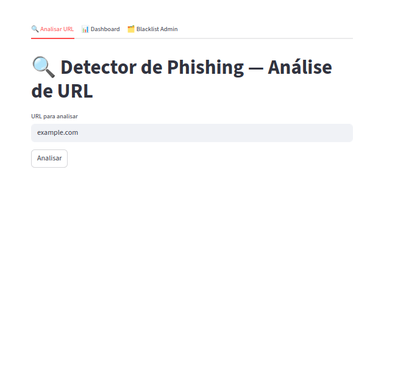
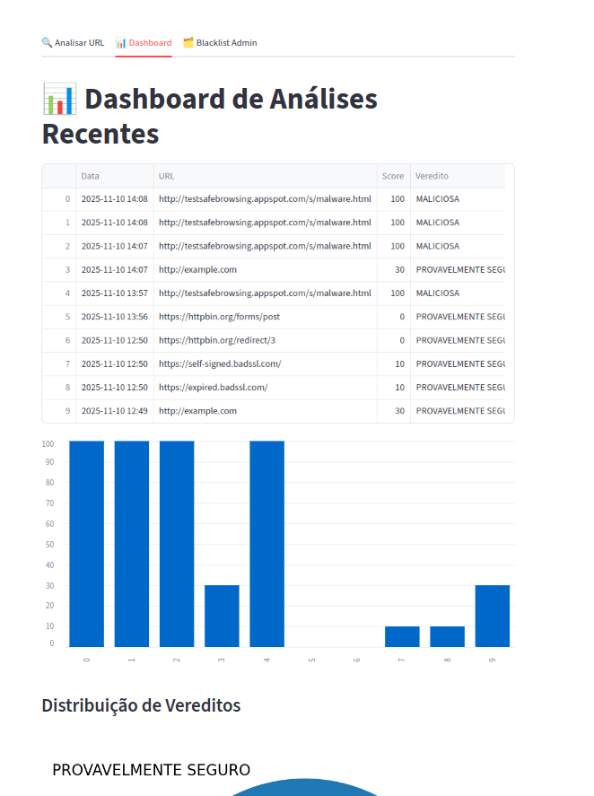
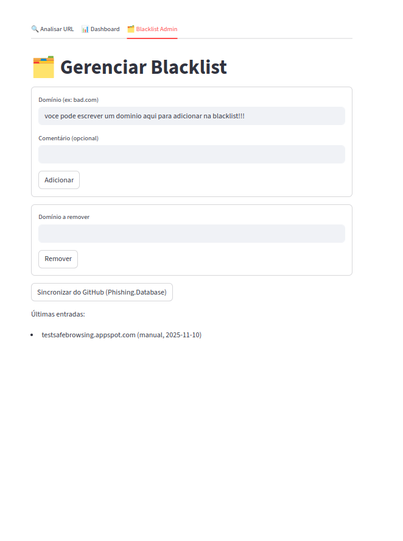
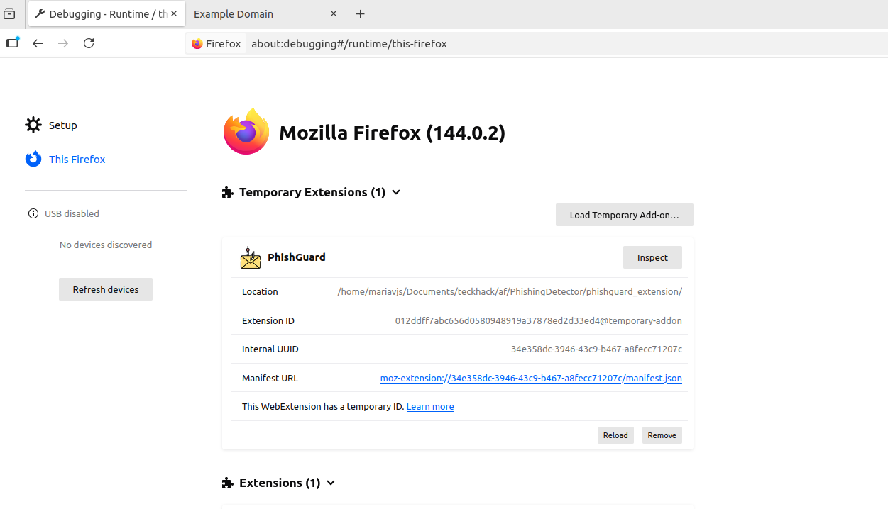
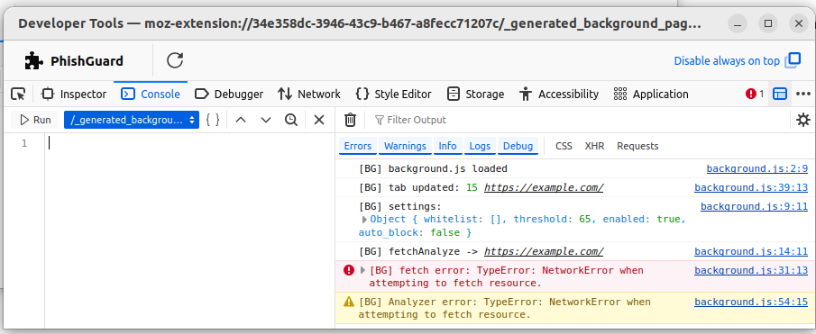
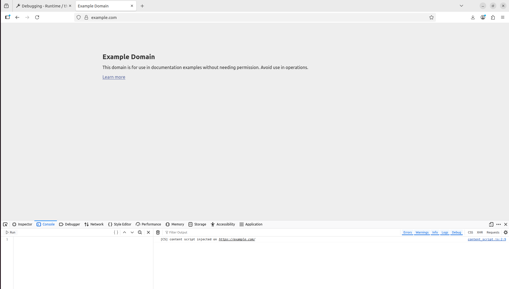

# PhishingDetector
#### Feito por: Maria Vitoria Jardim Sartori

O projeto feito para a matéria Tecnologias Hacker é um protótipo de ferramenta para **detecção de sites de phishing**.  

O projeto tem:
- **Uma API local em Python (Flask)**, responsável por analisar URLs e detectar características suspeitas;
- **Uma extensão para Firefox**, que realiza verificações em tempo real enquanto o usuário navega;
- **Um dashboard em Streamlit**, usado para visualizar histórico, métricas, resultados das análises e adicionar numa blacklist domínios que o usuário souber que é suspeito.

## APIs e Ferramentas Utilizadas

- **Google Safe Browsing API**: para verificação de URLs contra base de dados de sites maliciosos e phishing
- **Análise WHOIS**: verificação de informações do domínio
- **Verificação SSL/TLS**: validação de certificados de segurança
- **Análise DNS**: verificação de registros DNS do domínio

## Funcionalidades implementadas no projeto

### API (`src/api.py`)
- Endpoint `/health`: checa se o servidor está ativo;
- Endpoint `/analyze`: recebe uma URL, executa `analyze_url_with_b()` e devolve um JSON com:
  - **score** (0 a 100)
  - **is_suspicious** (true/false)
  - **motivos da detecção**
  - **metadados técnicos** (SSL, WHOIS, DNS etc.)
---

### Extensão do Firefox (`phishguard_extension/`)
- Verifica **as páginas visitadas**;
- Faz chamadas para o servidor local (`http://127.0.0.1:5000/analyze`);
- Mostra **banners de alerta** no topo da página e **notificações do navegador**;
---

### Dashboard Streamlit (para atingir o conceito C e B)
- Interface interativa para visualizar histórico de análises:
  - Score médio de cada domínio
  - Distribuição de domínios suspeitos
  - Exportação CSV
  - Adiciona em blacklist domínio suspeito
  - Relatório de características encontradas pelas ferramentas
- Usa os dados gravados em `data/history.db`.

Para rodar o streamlit, basta subir o docker

    docker compose build
    docker compose up

E se você quiser sair

    docker compose down

Exemplo:

---

##  Execução

### criação do ambiente virtual:

    python3 -m venv venv
    source venv/bin/activate
    pip install flask flask-cors requests tldextract dnspython beautifulsoup4 python-whois rapidfuzz sqlalchemy streamlit

### Rodar a api
    python src/api.py

### Extensão do Firefox

- Carregue a extensão no Firefox:
- Abra about:debugging#/runtime/this-firefox
- Clique em Load Temporary Add-on…
- Selecione o arquivo manifest.json da pasta phishguard_extension
- Clique em Inspect, para ver os logs em realtime

Exemplo:

### Estrutura do projeto: 
    PhishingDetector/
    │
    ├── src/
    │   ├── analyser.py
    │   ├── api.py
    │   ├── db.py
    │   ├── sync_utils.py
    │   └── ...
    │
    ├── phishguard_extension/
    │   ├── manifest.json
    │   ├── background.js
    │   ├── content_script.js
    │   ├── icons/
    │   └── ...
    │
    ├── data/
    │   └── history.db
    │
    └── README.md

